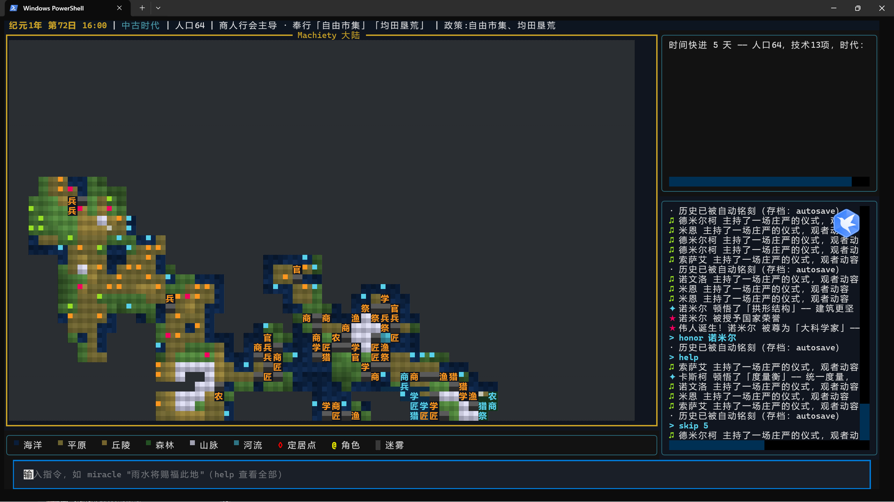

# Machiety

**LLM 驱动的命令行虚拟国家模拟游戏** —— 在终端中观察数百个 AI 智能体从渔村走向帝国的涌现式演化。



你以「超越存在」的身份降临这个世界：观察国民自主地劳作、交谈、争夺与反思，再通过有限的神谕、法令与灾难间接干预社会进程——所有干预都不可撤销。科技、政策、城市、伟人、奇观与时代更迭，都在个体互动中自然涌现。

## 特性

- **终端原生 TUI**：基于 [Textual](https://textual.textualize.io/) 的四区布局（状态栏 / 地图 / 信息面板与事件日志 / 命令栏），支持鼠标点击、缩放、追踪与暂停
- **LLM 驱动决策**：智能体的规划、对话、冲突裁决与夜间反思均由 LLM 生成；接入任意 OpenAI 兼容接口
- **离线可玩**：未配置 LLM 时自动降级为可复现的 MockLLM，全程无需网络
- **涌现式文明演化**：无预设科技树——灵感累积触发顿悟；派系提案经议会投票成为政策；定居点自发形成并建设区域
- **完整生命周期**：出生、衰老、死亡、伟人涌现与遗产、奇观立项与烂尾、时代更迭
- **异步并发**：asyncio + aiohttp，智能体并行规划、同地点批量对话、模型分层（小模型 / 大模型）、节流模式
- **单文件多槽位存档**：SQLite 存储于 `saves/saves.db`，支持自动快照、手动存档、启动选单与版本校验

## 环境要求

- Python **>= 3.11**
- 核心依赖：`textual`、`rich`、`aiohttp`、`numpy`（见 [pyproject.toml](pyproject.toml)）

## 安装

```bash
# 克隆仓库后，在项目根目录
pip install -e .

# 如需开发/测试依赖（pytest 等）
pip install -e ".[dev]"
```

安装后可直接使用 `machiety` 命令；也可以 `python -m machiety` 方式运行。

## 快速开始

```bash
# 1. （可选）配置 LLM。不配置则自动使用离线 MockLLM，同样全程可玩
cp config.toml.example config.toml    # Windows: copy config.toml.example config.toml

# 2. 启动图形界面模式
machiety

# 3. 或者无头文本模式模拟 5 天并输出报告
python -m machiety --headless --days 5
```

启动时会进入「文明的起点」选单：可载入已有存档、新建世界或删除存档；也可用命令行参数跳过选单：

```bash
machiety --new MyEmpire        # 跳过选单直接新开，存档命名为 MyEmpire
machiety --load MyEmpire       # 直接载入指定存档
machiety --seed 42             # 固定世界种子
```

### 命令行参数

| 参数 | 说明 |
| --- | --- |
| `--headless` | 无头文本模式（不进入 Textual UI） |
| `--days N` | 无头模式模拟天数（默认 5） |
| `--seed S` | 世界种子（缺省回退到 config 中的 seed） |
| `--config PATH` | 配置文件路径（默认 `config.toml`） |
| `--load NAME` | 载入指定存档 |
| `--new [NAME]` | 跳过启动选单直接新开（可选：为存档命名） |
| `--speed MS` | UI tick 间隔毫秒（覆盖默认 350ms） |
| `--population N` | 开局殖民者人数（覆盖 config settlers） |
| `--economy` | LLM 节流模式（规划缓存 + 分组反思） |

## 界面操作

| 按键 | 作用 |
| --- | --- |
| 方向键 | 移动地图光标 |
| `Enter` | 查看光标处详情 |
| `w` | 追踪光标处角色 / 取消追踪 |
| `m` | 切换视图模式 |
| `z` | 缩放（单格 / 双格渲染） |
| 鼠标点击 | 光标定位到点击地块 |
| `Space` | 暂停 / 继续模拟 |
| `Ctrl+Q` | 自动存档并退出 |

## 神谕指令（命令栏输入）

```text
watch [角色/定居点]      开启详细追踪面板（无参数取消）
miracle "神谕内容"       向全国广播一条神谕
disaster <类型> <地点>   降下灾难：flood / plague / locust / drought
inspire idea "概念"      向文明植入技术灵感（可指定领域）
gift <角色> <物品>       凭空赐予物品
decree "政策内容"        强行颁布国家政策（含"宣战"可讨伐城邦）
fund <定居点> [区域]     注入神力加速建设
launch wonder "名称"     发起奇观工程
honor <角色>             授予荣誉，助其成为伟人
avatar <角色>            指定先知，神谕借其口传播
history [条数]           翻阅编年史
skip [天数]              快进时间
map / status / epoch / policy / spirit / wonders / tech
                         查看地图说明 / 国家概况 / 时代 / 政策 / 精神 / 奇观 / 科技
save / load / saves / delete
                         存档管理（单文件多槽位）
quit / exit              自动存档并退出
help                     显示帮助
```

## 项目结构

```text
machiety/
├── __main__.py        # CLI 入口：参数解析、LLM 构建、启动选单
├── config.py          # TOML 配置加载（tomllib + dataclass）
├── engine/            # 引擎层：Game 调度器、世界、时钟、事件总线、冲突
├── agents/            # 智能体：Agent、管理器、记忆流、人格
├── civilization/      # 文明子系统：科技、政策、城市、伟人、奇观、时代
├── llm/               # LLM 抽象层：BaseLLM、OpenAI 客户端、MockLLM、提示词
├── commands/          # 指令解析与效果执行
├── embed/             # 自研哈希向量嵌入（无向量库重依赖）
├── persistence/       # SQLite 存档（单文件多槽位）
└── ui/                # Textual 界面：地图、状态栏、命令栏、侧面板、图例
tests/                 # pytest 测试（世界、记忆、命令、政策、持久化、UI 冒烟）
docs/                  # 完整文档
saves/                 # 存档目录（saves.db）
```

## 测试

```bash
python -m pytest tests -q
```

测试全部基于离线 MockLLM 与固定种子，无需网络与 API Key。

## 配置参考

完整配置项（`config.toml`）：

```toml
[world]
width = 64          # 世界宽度
height = 40         # 世界高度
settlers = 50       # 开局殖民者数量
# seed = 42         # 不填则每次随机

[llm]
base_url = "https://api.openai.com/v1"   # 任意 OpenAI 兼容接口
api_key = "sk-xxxx"
model = "gpt-4o-mini"          # 大模型：规划 / 裁决 / 顿悟 / 反思
model_small = "gpt-4o-mini"    # 小模型：简单决策 / 批量对话
concurrency = 8                # 并行请求上限
timeout = 60
temperature = 0.8
# economy = true               # 节流模式：LLM 调用量约降 40%~76%
```

## 文档

完整文档位于 [`docs/`](docs/README.md)，包括：

- [快速开始](docs/quick-start.md) 与 [配置参考](docs/configuration.md)
- [玩法指南](docs/gameplay-guide.md)：指令、系统机制与策略建议
- [架构总览](docs/architecture.md) 与各模块详解（引擎 / 智能体 / 文明 / LLM / UI / 命令 / 持久化）
- [测试指南](docs/testing.md) 与 [扩展指南](docs/extending.md)
- [部署指南](docs/deployment.md)

面向 AI 编码代理的项目约定见 [AGENTS.md](AGENTS.md)。
