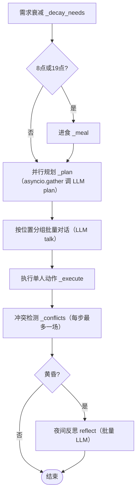

# 智能体系统

智能体（Agent）是 Machiety 的核心：每个国民拥有人格、需求、目标、记忆流与社会身份，基于环境感知与记忆检索自主决策。代码位于 `machiety/agents/`（`agent.py`、`manager.py`、`memory.py`、`personality.py`），冲突裁决在 `machiety/engine/conflict.py`，向量嵌入在 `machiety/embed/store.py`。

## Agent 数据模型

`Agent.spawn(id, rng, x, y, tick)` 工厂创建：随机职业、年龄、寿命、初始目标、库存、财富与需求，并写入一条高重要性出生记忆。核心字段：

| 字段 | 说明 |
| --- | --- |
| `name` / `age` / `lifespan` / `alive` | 身份与生命周期 |
| `profession` | 职业（影响采集加成、冲突与伟人候选） |
| `needs` | 五维需求（生存、安全、社交、尊重、自我实现） |
| `goals` / `mood` | 目标列表与情绪（夜间反思更新） |
| `inventory` / `wealth` | 物品库存与财富 |
| `influence` / `honor` / `faction` | 影响力、荣誉与派系归属 |
| `relations` | 与其他角色的关系 |
| `memory` | `MemoryStream` 记忆流 |
| `great_title` / `great_gift` | 伟人称号与馈赠（涌现后填充） |

`to_dict` / `from_dict` 提供完整序列化，供存档往返。

## 马斯洛需求与行为决策

- 五种需求每小时按比例衰减，`dominant_need()` 返回最低值需求，作为 LLM 规划的上下文关键词。
- 8 点与 19 点自动进食：消耗携带食物或从最近定居点取粮；饥饿会记录记忆并推动「粮食」类灵感。
- 行为（LLM `plan` 输出的 action）与需求的映射：

| 行为 | 效果 |
| --- | --- |
| `move` / `explore` / `patrol` | 受地形可通行性限制；探索揭开迷雾并记录记忆 |
| `gather` | 按地形与资源产出食物/木材/矿产，受职业与科技加成 |
| `build` | 靠近定居点时推进建筑进度 |
| `worship` | 提升自我实现与社交 |
| `research` | 提升尊重并累积科技灵感 |
| `trade` | 与同格伙伴交换，提升社交/尊重，累积经济灵感 |
| `rest` | 小幅恢复生存/安全 |
| `talk` | 群体对话（见下） |

## AgentManager 每小时循环

`manager.step(game)` 的执行顺序：

要点：

- **并行规划**：每个存活智能体的环境（地块、最近城市）、记忆检索结果、人格描述打包为 payload，并发调用 `generate("plan")`。
- **批量对话**：同一地块的智能体聚合为一次 `generate("talk")` 调用，返回群体对话摘要与关系变化，并发布社交/文化事件。
- **冲突限流**：每步最多裁决一场冲突，避免连锁反应。
- **夜间反思**：当日事件足够时触发，LLM 生成总结、情绪与新目标，写入摘要记忆。

## 人格特质（大五模型）

`personality.py` 五维：开放性、尽责性、外向性、宜人性、神经质。

- `describe()` 生成可读的人格标签供 LLM 上下文使用。
- 冲突实力系数：`conflict_power = 1 + (外向 + 尽责 − 神经质) × 0.3`，作为裁决时的影响力加权。
- 宜人性过高者在冲突检测中被跳过（回避争斗）。

## 记忆系统（三层 + 向量检索）

`memory.py` 的 `MemoryStream`：

| 层级 | 说明 |
| --- | --- |
| 观察记忆 observations | 容量上限滚动保留最新 |
| 摘要记忆 summaries | 夜间反思生成的总结 |
| 核心记忆 core | 重要性超过阈值的记忆直接晋升 |

- **嵌入**：`embed/store.py` 自研哈希叠加生成固定维向量并归一化（无外部向量库依赖）。
- **检索评分**：`相似度 × 时近衰减 × 重要性权重`，返回 Top-K；时近衰减体现「越久越淡」。
- `day_events(day_start_tick)` 提取当日事件供反思输入。

## 冲突与裁决

触发条件：同一地块 ≥ 2 人，且地块资源稀缺（剩余量 ≤ 3），且参与者非高宜人性。

`conflict.py` 调用 `generate("adjudicate")`，依据双方影响力（含人格系数）、情绪、职业裁决胜者与战利品；后果包括转移食物/财富、调整影响力与安全感、记录冲突记忆、发布 `combat` 事件。

## 扩展建议

- 新增行为：在 `AgentManager._execute` 添加 action 分支
- 调整生存压力：修改 `_decay_needs` 比例
- 调整记忆策略：`OBS_LIMIT`、`CORE_THRESHOLD`、检索权重与衰减函数
- 详见[扩展指南](extending.md)
