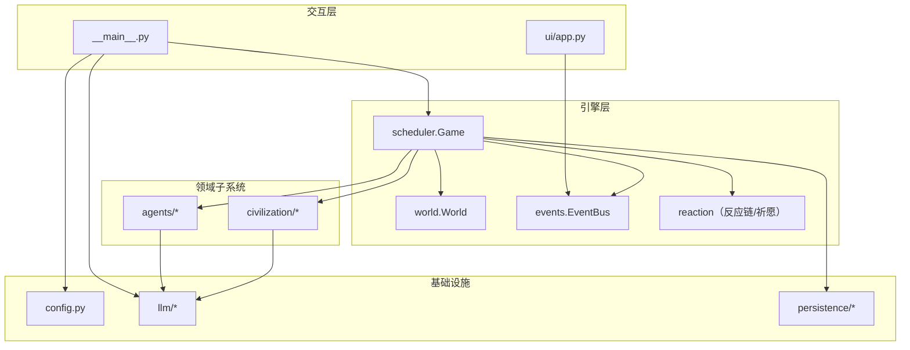
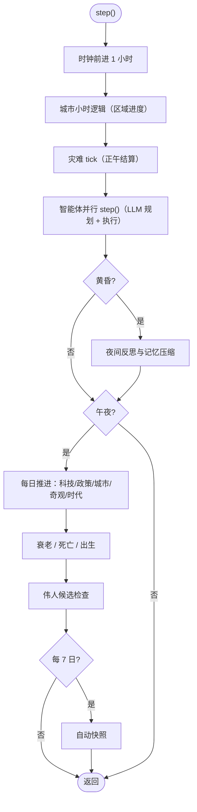

# 架构总览

Machiety 采用 **「控制循环 + 事件驱动 + 领域子系统」** 的分层架构：UI/CLI 以固定频率驱动调度器推进时间；各子系统维护自身状态并通过事件总线解耦通信；LLM 作为决策与叙事后端按任务类型分层调用。

## 分层结构

```text
┌─────────────────────────── 交互层 ───────────────────────────┐
│  __main__.py（CLI 入口）        ui/app.py（Textual 四区布局） │
├─────────────────────────── 引擎层 ───────────────────────────┤
│  scheduler.Game（调度中枢）  world.World（地形/资源/迷雾）    │
│  clock.Clock（时钟）         events.EventBus（事件总线）      │
│  conflict（冲突裁决）        reaction（反应链/祈愿板）        │
├─────────────────────────── 领域子系统 ───────────────────────┤
│  agents/（Agent、AgentManager、记忆、人格）                   │
│  civilization/（科技、政策、城市、伟人、奇观、时代）          │
├─────────────────────────── 基础设施 ─────────────────────────┤
│  config.py（TOML 配置）   llm/（BaseLLM/OpenAI/Mock）        │
│  embed/（哈希向量嵌入）   persistence/（SQLite 存档）        │
└──────────────────────────────────────────────────────────────┘
```



## 调度中枢 Game

`machiety/engine/scheduler.py` 的 `Game` 类是全局中枢，聚合世界、智能体管理器与全部文明子系统，并持有事件总线、时钟与 RNG。时间粒度为 **1 tick = 1 游戏小时**：



关键接口：`step()`、`skip_days(days)`、`unleash_disaster(type, x, y)`、`stats()`、`to_save_dict()` / `from_save_dict()`。

## 世界 World

`machiety/engine/world.py`：

- **地形生成**：Perlin 噪声（自实现）+ FBM 生成海拔与湿度，边缘衰减使大陆居中；按阈值划分海洋、平原、丘陵、森林、山脉，随后从山脉向海洋雕刻河流。
- **资源分布**：鱼群、木材、谷物、马匹、铁矿、奢侈品随地形概率放置。
- **查询接口**：`in_bounds`、`tile`、`neighbors4`、`tiles_in_radius`、`find_spawn`。
- **动态状态**：`dynamic_state()` / `apply_dynamic_state()` 仅序列化变化的格子（探索度、资源量、定居点、灾难、废墟），静态地形由种子重建。
- 复杂度：生成 O(W×H)；半径查询 O(r²)。

## 事件总线 EventBus

`machiety/engine/events.py`：

- 观察者模式：`subscribe` / `unsubscribe` / `publish(kind, text, tick, x, y, **data)`；回调异常相互隔离。
- 环形日志：`deque` 限制长度（`recent(n)` 查询），避免内存膨胀。
- 常见事件 kind：`combat`、`epiphany`、`policy`、`era`、`wonder`、`great_person`、`city`、`founding`、`rebellion`、`disaster`、`miracle`、`birth`、`death`、`system`、`reaction`、`prayer`、`granted`、`council`、`commune`。
- UI 订阅后写入事件日志；`NOTIFY_KINDS` 中的事件额外弹浮层通知，战斗事件触发地图闪烁。

## 异步模型与并发策略

- `Game.step` 与各子系统 `daily` 均为 async；LLM 调用基于 `aiohttp` 会话。
- 智能体规划用 `asyncio.gather` 并发执行，上限由 `LLMConfig.concurrency` 的信号量控制。
- 同地点多人的 `talk` 动作合并为一次批量调用；夜间反思批量提交。
- 节流模式（`economy`）：规划缓存 + 分组反思，显著降低调用量。

## 设计模式应用

| 模式 | 应用点 |
| --- | --- |
| 观察者 | EventBus 订阅/发布，UI 与子系统解耦 |
| 策略 | 科技对不同活动的差异化加成；灾难的差异化影响 |
| 工厂 | `Agent.spawn`、`World.generate`、顿悟生成技术对象 |
| 模板方法 | `BaseLLM.generate` 抽象接口，`OpenAIChat` / `MockLLM` 各自实现 |

## 扩展点速览

- 新增 LLM 任务类型：在 `BaseLLM` 约定任务名，`MockLLM` 与提示词同步实现
- 新增灾难类型：调度器的持续时间/名称映射与影响逻辑
- 新增区域类型：`CitySystem` 的需求映射与成本常量
- 新增科技类别：`TechSystem` 的类别与灵感池键
- 新增玩家指令：见[命令系统](commands.md)与[扩展指南](extending.md)

## 相关文档

- [智能体系统](agents-system.md) ｜ [文明演进系统](civilization.md) ｜ [LLM 集成层](llm.md) ｜ [用户界面](ui.md) ｜ [数据持久化](persistence.md)
