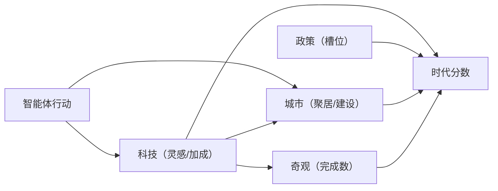

# 文明演进系统

文明层包含六个子系统，全部位于 `machiety/civilization/`，由调度器在每日结算时统一调用 `daily()`：

| 子系统 | 文件 | 职责 |
| --- | --- | --- |
| 科技 | `tech.py` | 灵感池、顿悟、传播与活动加成 |
| 政策 | `policy.py` | 派系、提案、投票、四槽位、动荡与叛乱 |
| 城市 | `city.py` | 定居点、区域建设、人口与存粮、外邦城邦 |
| 伟人 | `great_people.py` | 涌现判定、称号馈赠、遗产 |
| 奇观 | `wonder.py` | 跨代工程、进度、烂尾与全局加成 |
| 时代 | `epoch.py` | 综合指数与时代更迭 |

## 科技系统（tech.py）

**无预设科技树**，流程为「灵感 → 顿悟 → 传播」：

1. **灵感池**：五个类别（粮食、战争、精神、经济、建造）分别累积。来源包括研究行为、交易、饥饿、灾难、玩家 `inspire` 指令等。
2. **顿悟**：任一类别达到阈值时，调用 `generate("epiphany")` 生成技术名称与效果；从候选职业中随机选出「发明者」，发布 `epiphany` 事件并提升发明者影响力。
3. **传播**：已发明技术每日按识字率与道路因子（定居点联通近似）提升 spread，逐步扩散至社会。
4. **加成**：`bonus(keyword)` 按关键词匹配技术名称/效果，为采集、建造、研究等活动提供累计加成。

玩家可用 `inspire idea [领域] "概念"` 植入灵感种子（`pending_seed`），定向引导下一次顿悟。

## 政策系统（policy.py）

- **派系**：按职业归属划分，各派系维护支持度。
- **每日流程**：动荡值自然衰减；有空槽位且随机触发时，由 `generate("policy_proposal")` 生成提案，议会按支持度与成员影响力加权投票：
  - 通过 → 写入生效槽位，发布 `policy` 事件；
  - 否决 → 降低提案派系支持度。
- **四槽位**：军事、经济、外交、文化，每槽至多一项生效。
- **decree 副作用**：玩家 `decree` 强行颁布会提升动荡值（+12），动荡过高触发 `rebellion` 叛乱事件；含「宣战」关键词时设置战争目标，开启讨伐外邦城邦流程。
- **国家精神**：由主导派系与生效政策合成描述，显示于状态栏与 `spirit` 指令。

## 城市系统（city.py）

- **自发建城**：足够多居民聚居在无城地块时建立定居点（发布 `founding` 事件并标记地块）。
- **区域提议**：统计居民主导需求映射为区域类型——市场、学宫、圣地、工业区、港口、剧院广场。
- **建设推进**：每小时推进在建区域进度（居民劳动 + 技术加成），完成后落成并发布事件；玩家 `fund` 注入神力加速或直接立项。
- **人口与存粮**：定居点维护存粮（智能体进食与灾难消耗），满足食物条件时自然出生新成员。
- **外邦城邦**：世界边缘生成外邦城邦与 NPC 市民（`foreign` 标记）；宣战后军人按曼哈顿距离行军，抵达后 LLM 裁决胜负，胜者兼并（清除 foreign 标记、转换 NPC 身份），败方撤退并降低安全感。

## 伟人系统（great_people.py)

- 每日检查候选：影响力 + 荣誉达到阈值的角色，按概率涌现为伟人。
- 涌现时调用 `generate("great_person")` 生成伟大称号与馈赠，发布 `great_person` 事件。
- 伟人去世时 `on_death()` 留下文化遗产并发布历史事件。

## 奇观系统（wonder.py）

- `launch wonder "名称"` 立项，同一时间仅允许一项在建。
- 每日进度增益由人口与技术数量计算；增益过低则连续无进展计数累积，超过限制判定**烂尾**（发布事件）。
- 进度达到成本时完成：调用 `generate("wonder_effect")` 生成效果与叙事文本，叠加全局加成（粮食、研究等），发布 `wonder` 事件。

## 时代系统（epoch.py）

- 时代分数 = 科技数量与传播 + 政策槽位填充 + 定居点数量 + 文化事件 + 已完成奇观数。
- 分数达到下一时代阈值时提升时代索引，调用 `generate("era_event")` 生成叙事文本并发布 `era` 事件。

## 系统间耦合

- 科技加成提升采集与建设效率；城市规模促进科技传播。
- 政策槽位与奇观完成数计入时代分数；时代事件反馈文化叙事。
- 伟人提升影响力与荣誉，奇观提供全局加成，共同影响后续涌现。
- 灾难与动荡提供挑战与恢复机制，平衡演进节奏。
