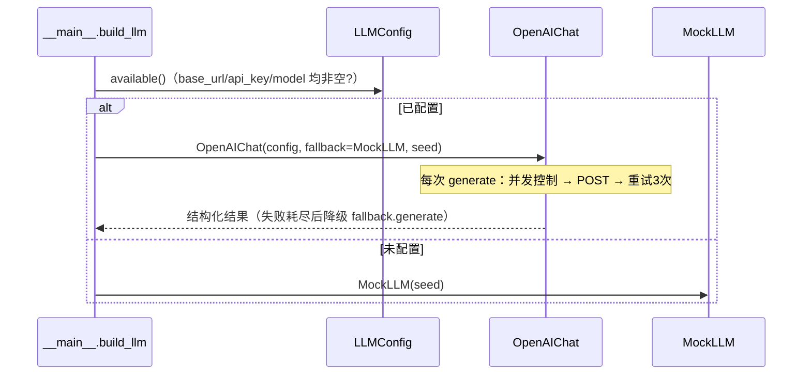

# LLM 集成层

代码位于 `machiety/llm/`：`base.py`（抽象接口与宽容 JSON 解析）、`openai_client.py`（OpenAI 兼容客户端）、`mock.py`（离线实现）、`prompts.py`（提示词构建）。

## 后端选择与降级链路



- 启动时未配置 → 直接使用 MockLLM，并打印提示。
- 运行期任何异常（网络、HTTP 非 200、解析失败）→ 指数退避重试最多 3 次（0.5s / 1s / 2s）→ 仍失败则调用 fallback（MockLLM），`fallbacks` 计数 +1。**模拟永不因 LLM 中断。**

## BaseLLM 抽象接口

```python
class BaseLLM:
    name: str
    calls: int        # 调用次数统计
    fallbacks: int    # 降级次数统计
    async def generate(self, task: str, payload: dict) -> dict: ...
    def close(self): ...
```

**任务类型约定**（`task` 参数取值）：

| task | 用途 | 模型层级 |
| --- | --- | --- |
| `plan` | 智能体每小时行动规划 | 小模型（节流模式有缓存） |
| `talk` | 同地点群体对话摘要与关系变化 | 小模型（批量） |
| `adjudicate` | 冲突/战斗裁决 | 大模型 |
| `reflect` | 夜间反思（总结、情绪、新目标） | 小模型（分组批量） |
| `epiphany` | 顿悟：技术名称与效果 | 大模型 |
| `policy_proposal` | 派系政策提案 | 大模型 |
| `era_event` | 时代更迭叙事 | 大模型 |
| `wonder_effect` | 奇观完成效果 | 大模型 |
| `great_person` | 伟人称号与馈赠 | 大模型 |
| `wonder_launch` | 远见者倡议奇观命名 | 大模型 |
| `interpret` | 玩家干预后代表人物的解读与转述 | 大模型（节流模式单代表、小模型） |
| `prayer` | 国民向玩家祈愿（intent 枚举便于匹配） | 小模型 |
| `debate` | 议会辩论陈词与票数摆动 swing | 大模型（节流模式跳过） |
| `council` | 灾难应对会议策略与 focus | 大模型（节流模式模板降级） |
| `commune` | 玩家与角色直接对话（talk 指令） | 小模型 |

**宽容 JSON 解析**：`parse_json_loose` 剥离代码围栏（```json ... ```）、截取首个 `{...}` 块，容忍大模型输出格式差异。所有解析 LLM 输出的代码必须走此函数。

## OpenAIChat 客户端

- **会话**：懒初始化 `aiohttp.ClientSession`（含超时），`close()` 释放。
- **并发**：`asyncio.Semaphore(concurrency)` 限制并行请求。
- **模型分层**：按任务 tier 选择 `model_small` 或 `model`，降低成本与延迟。
- **请求**：`prompts.build_messages(task, payload)` 构建 messages；`Authorization: Bearer {api_key}`；POST `{base_url}/chat/completions`。
- **思考模式**（`thinking = true`）：请求附带 `enable_thinking` 并改用 SSE 流式读取（只累积 `delta.content`，忽略思考过程），兼容 Qwen3 等混合思考模型；关闭时显式传 `enable_thinking: false`。
- **节流模式**（`economy = true`）：`plan` 结果按特征缓存、`reflect` 分组提交，调用量约降 40%~76%。

## MockLLM 离线实现

- 按任务类型路由到 `_task_<task>` 处理器；基于种子 RNG 与模板生成结构化结果——**未配置 LLM 时游戏完整可玩，固定种子可复现**。
- 用途：离线游玩、开发调试、回归测试、可复现实验。

## 提示词工程要点

- **结构化上下文**：角色属性、环境信息、记忆检索结果、时间与昼夜组装为消息；明确任务类型与期望输出字段。
- **输出格式**：强制要求 JSON 并明确字段名与取值范围；解析端用 `parse_json_loose` 兜底。
- **温度与长度**：小任务低 temperature、小 max_tokens；复杂叙事适当放宽。
- **可复现**：固定种子与提示词版本，便于回归定位。

## 成本与监控建议

- 关注 `calls` 与 `fallbacks` 统计（无头模式报告与 `status` 指令会展示）。
- fallbacks 比率过高 → 检查网络、配额、并发与超时设置。
- 合理设置 `concurrency` 避免触发服务端限流；`economy` 模式可显著降低长周期模拟的调用量。

## 接入自定义后端

继承 `BaseLLM` 并实现 `generate(task, payload)` 返回 dict；在 `__main__.build_llm` 中按条件构造。务必保证：任意异常路径能返回可用结果（可内部持有 MockLLM 兜底），且离线测试可覆盖。详见[扩展指南](extending.md)。
