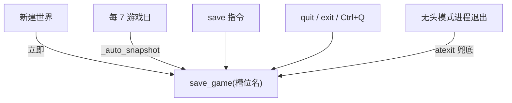

# 数据持久化

持久化子系统位于 `machiety/persistence/`：`db.py`（SQLite 表结构与连接）、`saver.py`（存档读写与槽位管理）。采用 **「结构化表 + JSON 字段」** 混合模式；静态地形由种子重建，只存动态变化。

## 单文件多槽位存档

所有存档集中在 **`saves/saves.db`** 的 `save_slots` 表中：

| 列 | 说明 |
| --- | --- |
| `name`（主键） | 槽位名（如 `autosave`、`MyEmpire`） |
| `updated_at` | 更新时间 |
| `summary` | JSON 摘要（进度、时代、人口、种子），供选单展示，避免加载全量数据 |
| `data` | 完整存档 JSON |

核心 API（`saver.py`）：

- `save_game(game, name)`：写入/覆盖槽位（`game.to_save_dict()` → 摘要 + 全量数据）。
- `load_game(name, config, llm)`：按名称加载槽位；旧版独立 `.db` 文件走只读回退（`_load_legacy`）；版本不匹配抛 `SaveVersionError`。
- `list_slots(config)` / `delete_save(config, name)`：枚举与删除。

## 数据库表结构（db.py）

`open_db` 确保目录存在并执行 schema（`CREATE TABLE IF NOT EXISTS` + 缺失列自动迁移）：

| 表 | 主键 | 内容 |
| --- | --- | --- |
| `meta` | key | 键值元数据（JSON），含 `schema_version` |
| `agents` | id | 每个智能体的完整 JSON |
| `tiles_dynamic` | idx | 格子动态状态：explored、amount、settlement、disaster、ruins |
| `civ` | key | 文明子系统状态（科技/政策/城市/伟人/奇观/时代，JSON） |
| `chronicle` | — | 编年史事件（tick、kind、text、坐标、扩展数据） |
| `save_slots` | name | 单文件多槽位存档（见上） |

写入使用 `executemany` 批量插入 agents 与 tiles_dynamic；无外键约束，靠业务语义关联。

## 存档触发时机

- 自动快照失败被捕获，不影响模拟；命名含纪元与日期信息。
- UI 模式不注册 atexit（避免与退出指令重复写入同一槽位）；无头模式注册 `_save_quietly` 静默兜底。

## 序列化设计

- `Game.to_save_dict()`：meta、时钟、观察者状态、灾难、智能体、世界动态状态、文明子系统全量导出。
- `Game.from_save_dict(config, llm, data)`：重建世界（seed 恢复静态地形）→ `apply_dynamic_state` 恢复动态格子 → 重建智能体与文明状态；缺失字段提供默认值，具备一定向后兼容能力。
- 世界动态状态仅保存变化格子，显著减小体积。

## 版本兼容

- `schema_version` 记录于 `meta` 表；加载时 `_check_version` 校验，高于当前版本的存档拒绝读取并抛 `SaveVersionError`（防止未来版本存档被旧代码破坏）。
- 旧版独立文件存档只读兼容；修改存档结构时需同步升级版本常量并补往返测试。

## 备份与恢复建议

- 全量备份 = 复制 `saves/saves.db` 单文件。
- 存档损坏时：用 `saves` 查看槽位，`load` 最近可用快照回滚。
- 导出/导入：可用任意 SQLite 客户端导出各表为 CSV/JSON；回填时保持 UTF-8 与主键唯一。

## 相关测试

- `tests/test_persistence.py`：存档往返一致性（seed/clock/agents/记忆）。
- `tests/test_batch_features.py`：编年史与新字段（prophet/ruins/foreign）往返、存档版本化。
