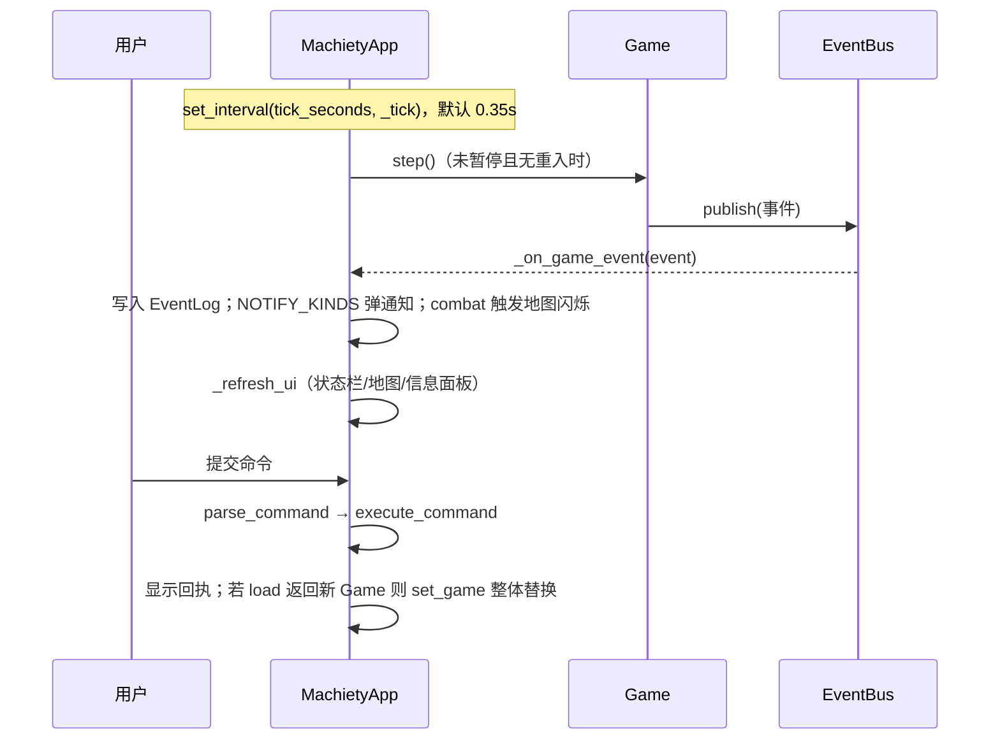

# 用户界面

UI 层位于 `machiety/ui/`，基于 Textual 构建四区布局的终端应用。主应用 `MachietyApp`（`app.py`）协调布局、模拟循环与指令执行；样式集中在 `styles.tcss`。

## 布局与组件

```text
┌──────────────────────── StatusBar（顶部，dock top）──────────────┐
├──────────────────────────────┬───────────────────────────────────┤
│  MapView（地图，2fr）         │  InfoPanel（详情/回执）           │
│  LegendBar（图例条）          │  EventLog（事件日志，带图标）      │
├──────────────────────────────┴───────────────────────────────────┤
│                CommandBar（命令栏，dock bottom）                  │
└──────────────────────────────────────────────────────────────────┘
```

| 组件 | 文件 | 职责 |
| --- | --- | --- |
| `MachietyApp` | `app.py` | 布局、键位绑定、tick 循环、事件订阅、指令提交、存档切换 |
| `MapView` | `map_view.py` | ASCII 地形渲染、视口跟随、迷雾、资源叠加、点击定位、缩放/模式切换 |
| `LegendBar` | `legend.py` | 地图图例条 |
| `StatusBar` | `status_bar.py` | 日期、时代、人口、国家精神、生效政策 |
| `InfoPanel` / `EventLog` | `side_panel.py` | 上下文详情（可滚动）；事件图标映射的流水日志 |
| `CommandBar` | `command_bar.py` | 输入框、历史上下翻（上限 100 条）、Tab 补全 |

## 模拟循环与事件联动



要点：

- `TICK_SECONDS = 0.35`（每游戏小时的现实间隔），可用 `--speed` 覆盖。
- `_tick` 内部 try/except 包裹，模拟异常只通知不崩溃；`_ticking` 标志防止重入。
- `NOTIFY_KINDS = {epiphany, era, wonder, great_person, rebellion, disaster, founding, miracle, prayer, granted}` 决定哪些事件弹浮层通知。
- **节流刷新**：记录上次渲染的游戏时刻与事件数量，无变化时跳过重绘。
- **追踪跟随**：`watch` 开启后侧栏跟随显示目标详情；命令输出优先于追踪面板覆盖（一次性回执）。

## 键位绑定

`BINDINGS`：方向键移动光标、`Enter` 查看详情（inspect）、`w` 追踪、`m` 切换视图、`z` 缩放、`Space` 暂停/继续、`Ctrl+Q` 退出（自动存档）。

## 地图渲染（MapView）

- **视口渲染**：仅绘制当前视口，光标移动时视口跟随；`_viewport` 计算 x0/y0/cols/rows 并有默认值兜底。
- **渲染管线**：逐地块处理迷雾 → 地形字符与样式 → 资源叠加（仅 `cell_width=2` 时）→ 定居点高亮 → 灾难底色 → 同格单位聚合为计数 → 战斗闪烁（按时间戳清理）→ 光标反显。
- **像素风方案**：半块字符实现 2×2 像素着色 + 叠加符号，单格/双格由 `toggle_zoom` 切换。
- **点击定位**：`on_click` 将鼠标偏移映射为世界坐标（注意扣除 `content_offset`）后移动光标。
- `cursor_info()` 输出光标处的地块、资源、定居点与国民列表，供 `Enter` 详情与可访问性文本描述。

## 样式系统（styles.tcss）

- 布局：状态栏 `dock: top`、命令栏 `dock: bottom`；主区域 `height: 1fr`，地图与右栏按 `2fr / 1fr` 分栏。
- 外观：边框圆角、内边距与颜色使用 Textual 主题变量（`$primary`、`$surface`、`$text` 等）。
- 响应式：`fr` 单位与最小尺寸约束适配不同终端尺寸。
- 注意：`height: 1` 的单行 widget 不要加 `border`（边框会挤掉内容行导致不可见）。

## 存档切换（set_game）

`load` 指令返回新 `Game` 实例时：解绑旧事件总线订阅 → 替换 `game` 引用（含 MapView）→ 重新订阅新总线 → 清空并重写日志提示，实现无缝切换。

## 性能要点

- 视口裁剪渲染；单位聚合计数；闪烁字典定期清理。
- EventBus 环形日志限制内存；tick 异常隔离保证 UI 存活。
- UI 冒烟测试见 `tests/test_ui_smoke.py`，滚动验证见 `tests/_scroll_check.py`。
